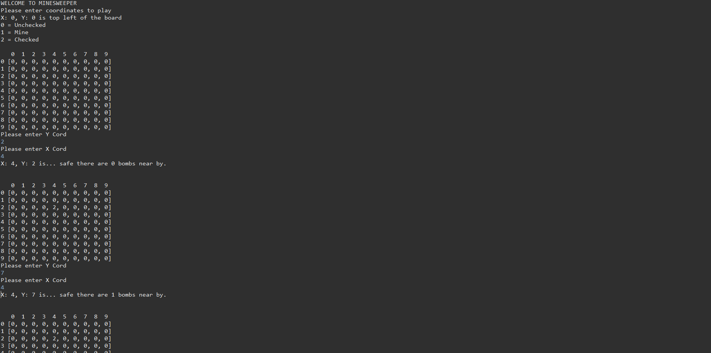

# Minesweeper-java

## Preview

### Java Console

## Setup

* Download and navigate to minesweeper.java and run application

## Description of project (spec / MVP)

### MVP:

 - Recreate a simplified version of the game Minesweeper to be played in the java console The game should be able to randomly generate 10 mines in a 10x10 grid The user will be able to enter a command that represents a coordinate to check a location for a mine The application will display a number from 0-8 depending on how many mines surround that location If the user selects a mine, the game will respond "boom!" and the game will be lost If every non-mine square has been revealed, the game is won Render the grid to the console after every user command -- [x]

  
* Bonus: List of products in cart:
 Allow for the user to configure number of mines and grid size via a configuration.json file (Difficult) Discovering an empty square should reveal all squares around it, and cascade into other nearby empty squares

## Approach

* Looked at an online version of minesweeper and played it to understand the functionality of the game.
* Broke down the game into small comments. E.g. Create a 10x10 grid, fill grid with default value, place 10 mines in grid...
* I think breaking down the code into small sections allowed me to focus clearly on what code to write.

## Reflection
* What went well?
  - I think breaking down of the problem went well as laying in out pseudo-code enables me to understand it better
* What are you proud of? 
  - I am proud that my understanding of Java especially syntax has improved through building this application. E.g. General syntax of typing functions, what they return and parameters.
* What was a challenge?
  - Working on the functionality to check if the surrounding squares contain mines was a little bit of a challenge. Initially I didn't check if the surrounding coordinates were in bounds in the edge cases where a user selects a corner or edge square on the board. I fixed this by creating another inBounds check function which will take in the surrounding coords first and check if they are inbounds before checking for bombs.
* What you'd do differently?
  - As I used 0 for unchecked, 1 for mine, 2 for checked. I could potentially create another mine class which will have it's on properties of coordinates, isExploded which will make the application more OOP.

## Future Goals

* Create classes for squares and mines which can extend squares taking the coordinates property, and isChecked. Each item in the 2D array will contain a square or mine object instead of 0/1/2.

## Further reading or links to inspiration

*  [Minesweeper Online]( https://minesweeper.online/)
*  [What is OOP?]( https://www.techtarget.com/searchapparchitecture/definition/object-oriented-programming-OOP)

## Stay in touch

*  [Portfolio]( https://edric-khoo.vercel.app/)
*  [Linkedin]( https://www.linkedin.com/in/edric-khoo-98881b173/)

